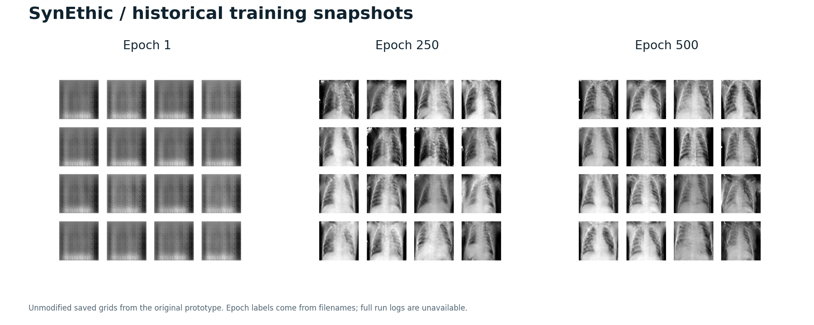

# SynEthic

**Synthetic chest X-ray generation with TensorFlow.** A personal machine learning project by Jefferson Duggan.

[](https://github.com/jnaggud/synethic/actions/workflows/checks.yml)


[](LICENSE)

SynEthic implements a configurable Deep Convolutional Generative Adversarial Network (DCGAN) and an experimental SSIM similarity penalty. The supported workflow covers image preprocessing, training, checkpoint recovery, sample generation, and standalone model export.

**[Results & evidence](docs/RESULTS.md) · [Engineering decisions](docs/DESIGN.md) · [Usage guide](docs/USAGE.md) · [Dataset & attribution](docs/DATA.md)**



*Saved outputs from the original prototype, showing chest-like structure alongside visible artifacts. Epoch labels come from filenames; full historical run logs are unavailable. These are not outputs from the current smoke test. [Image provenance →](docs/RESULTS.md)*

> **Scope:** This is a research and engineering demonstration. Clinical utility, image-quality benchmarks, and formal privacy protection have not been established.

## Engineering highlights

| Capability | Implementation |
| --- | --- |
| Image pipeline | JPEG/PNG → grayscale → resize → normalize, using `tf.data`; reads one explicit training folder. |
| Custom objective | TensorFlow-native SSIM penalty with a tested, nonzero gradient path. |
| Experiment recovery | Restores both models, optimizer state, completed epoch, reference images, and training-noise state. |
| Inference and handoff | Generates seeded image grids from a checkpoint and exports a standalone Keras generator. |
| Run inspection | Saves configuration, environment metadata, CSV losses, and fixed-noise samples. |
| Verification | CPU regression tests and a full dataset-free train/export demo run in GitHub Actions. |

## Run the demo

Use **Python 3.10**. No dataset download or GPU is required for this execution check.

```bash
git clone https://github.com/jnaggud/synethic.git
cd synethic
python3.10 -m venv .venv
source .venv/bin/activate
python -m pip install -r requirements.txt

python train.py --smoke-test --cpu --run-dir runs/smoke
python generate.py --run-dir runs/smoke --output-dir runs/preview --cpu --export-model
```

On Windows, activate the environment with `.venv\Scripts\activate`.

Open **`runs/preview/samples.png`** to see the output. The smoke test trains a small model on four random 16×16 fixtures; it verifies the pipeline and produces noise-like images, not meaningful X-rays. The exported `generator.keras` can be loaded independently of the training code. [Export example →](docs/USAGE.md#use-the-exported-model)

```text
runs/
├── smoke/                    # Training run
│   ├── config.json           # Model and data options
│   ├── environment.json      # Runtime versions and devices
│   ├── metrics.csv           # Per-epoch losses, time and step count
│   ├── epoch-0001.png        # Fixed-noise sample grid
│   └── checkpoints/          # Last three training checkpoints
└── preview/                  # Inference output
    ├── samples.png
    ├── generation.json       # Checkpoint, epoch, seed and configuration
    └── generator.keras       # Optional standalone model
```

## Train on chest X-rays

Download the chest X-ray portion of the [Mendeley dataset](https://data.mendeley.com/datasets/rscbjbr9sj/2), then point the trainer at a single training class folder. See [dataset setup and attribution](docs/DATA.md).

```bash
python train.py \
  --data-dir chest_xray_data/chest_xray/train/PNEUMONIA \
  --run-dir runs/pneumonia \
  --epochs 50 --batch-size 16
```

The default model generates 64×64 grayscale images. The loader does not recurse into validation or test folders. Training on actual images requires more compute than the smoke test; pretrained weights are not bundled.

For a small actual-image check, resume instructions, model export, and optional Apple Silicon acceleration, use the **[usage guide](docs/USAGE.md)**. Run `python train.py --help` or `python generate.py --help` for CLI options.

## How it works

The generator upsamples a random vector into an image; the discriminator learns to distinguish generated and training images. A custom component, `PrivacyGuardian`, compares generated images with a fixed reference subset and penalizes SSIM values above a threshold:

```text
generator loss = adversarial loss + weight × mean(max(0, maximum SSIM − threshold))
```

This is a similarity heuristic. It is neither differential privacy nor a dataset-wide memorization test. [Architecture, objective, and tradeoffs →](docs/DESIGN.md)

## Project structure

| Path | Purpose |
| --- | --- |
| [`train.py`](train.py) | Models, similarity objective, and training CLI |
| [`generate.py`](generate.py) | Checkpoint inference and model export CLI |
| [`tests/`](tests/) | Data, gradient, training, recovery, and inference regression tests |
| [`docs/`](docs/) | Usage, design decisions, evidence, and dataset attribution |
| [`experiments/`](experiments/) | Archived prototypes with documented limitations |
| [`scripts/`](scripts/) | Rebuild documentation figures from saved outputs |

## Development

```bash
python -m pip install -r requirements-dev.txt
ruff check .
ruff format --check .
python -m pytest -q
```

See [contributing](CONTRIBUTING.md) for the supported scope and validation workflow. CI also runs the documented demo and saves its sample grid and logs as a `smoke-demo` artifact.

## License

Source code: [MIT](LICENSE). Documentation images and layouts: [CC BY 4.0 with attribution](docs/DATA.md). The source dataset retains its own terms. Datasets, checkpoints, environments, and private working documents are excluded from this repository.
