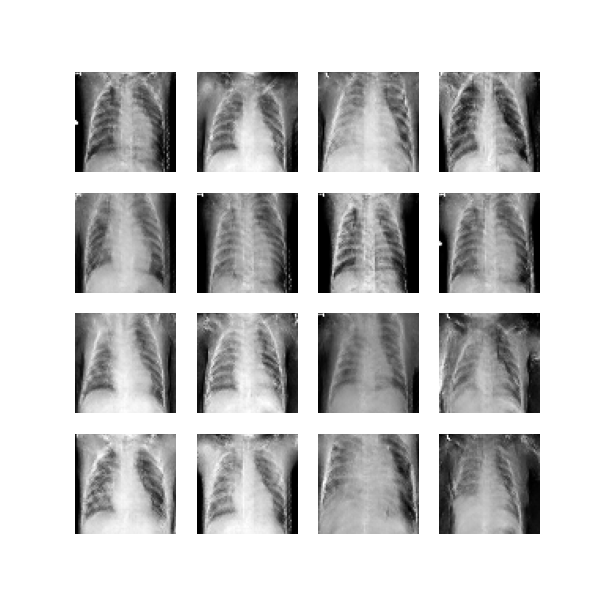
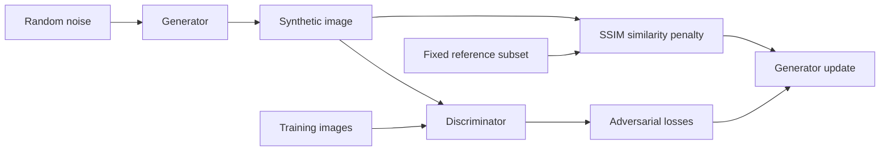

# SynEthic

### Synthetic chest X-ray generation with TensorFlow

[](https://github.com/jnaggud/synethic/actions/workflows/checks.yml)


[](LICENSE)

SynEthic is a research prototype for generating grayscale chest X-ray images with a Deep Convolutional Generative Adversarial Network (DCGAN). It combines a configurable TensorFlow training pipeline with **PrivacyGuardian**, an experimental SSIM-based penalty for excessive similarity to a small reference set.

The project explores an important question in synthetic medical imaging: how can a model generate useful structure while discouraging direct similarity to its training examples? It demonstrates the engineering pipeline; it does not establish clinical usefulness or a formal privacy guarantee.

<p align="center">
  
</p>

*Historical prototype output, labeled epoch 500. These are existing model outputs, not samples from the new quick-start run. Artifacts remain visible. See [results and provenance](docs/RESULTS.md).*

## What it demonstrates

- **An end-to-end image pipeline:** JPEG/PNG loading, grayscale conversion, resizing, normalization, training, and sample export.
- **Configurable adversarial models:** image size, batch size, network width, noise dimension, and learning rate are CLI options.
- **Differentiable similarity regularization:** SSIM is computed entirely in TensorFlow, with a tested gradient path to the generator.
- **Inspectable experiments:** fixed-noise image grids, CSV losses, saved configuration, and environment metadata.
- **Resumable training:** checkpoints include models, optimizers, epoch, reference images, and the training-noise generator.
- **Automated verification:** CPU tests cover preprocessing, gradients, training updates, and checkpoint restoration.

## Quick start

Use **Python 3.10**. The supported dependency set is pinned in `requirements.txt`.

```bash
git clone https://github.com/jnaggud/synethic.git
cd synethic
python3.10 -m venv .venv
source .venv/bin/activate
python -m pip install -r requirements.txt
python train.py --smoke-test --cpu --run-dir runs/smoke
```

On Windows, activate with `.venv\Scripts\activate`.

The smoke test uses four random 16×16 fixtures and a small model. It checks that training, image export, metrics, and checkpointing work; its output is **not** a medical-imaging result. No dataset download is required.

```text
runs/smoke/
├── config.json
├── environment.json
├── metrics.csv
├── epoch-0001.png
└── checkpoints/
```

To restore the same run and train one additional epoch:

```bash
python train.py --smoke-test --cpu --run-dir runs/smoke --resume
```

## Train on chest X-rays

Download and extract the chest X-ray portion of the [Mendeley dataset](https://data.mendeley.com/datasets/rscbjbr9sj/2). The source images and pretrained weights are not bundled. Read the [dataset attribution](docs/DATA.md) before using or redistributing the data.

Point `--data-dir` directly at the **training class directory**, for example:

```bash
python train.py \
  --data-dir chest_xray_data/chest_xray/train/PNEUMONIA \
  --run-dir runs/pneumonia \
  --epochs 50 \
  --batch-size 16
```

The loader reads only images directly inside the specified folder, avoiding accidental mixing of nested training, validation, and test splits. Training defaults to 64×64 grayscale images. Larger runs need substantially more compute than the smoke test; no training-time guarantee is provided.

For a small check with actual images:

```bash
python train.py \
  --data-dir chest_xray_data/chest_xray/train/PNEUMONIA \
  --run-dir runs/data-check \
  --cpu --max-images 8 --batch-size 2 --steps-per-epoch 1 \
  --gen-filters 64 --disc-filters 8
```

Use `python train.py --help` for all options. `--epochs` means additional epochs, including on resume. Resume with the same model, data, and training options plus `--resume`; incompatible configurations and accidental overwrites are rejected. Seeds improve repeatability, but exact continuation across devices or interrupted runs is not guaranteed.

### Apple Silicon GPU option

The default requirements support CPU execution. Apple Silicon users can optionally install `python -m pip install -r requirements-metal.txt` and omit `--cpu`. Metal acceleration is optional and has not been benchmarked for this release. The supported trainer uses float32; the archived mixed-precision experiment is not the recommended entry point.

## How it works



The generator projects a noise vector into a small feature map and upsamples it through four convolutional blocks. The discriminator learns to distinguish generated images from training images. PrivacyGuardian compares each generated image against a fixed subset of training images and penalizes the maximum SSIM when it exceeds a configurable threshold.

`generator loss = adversarial loss + privacy weight × mean(max(0, maximum SSIM − threshold))`

Pixels are mapped from the model's `[-1, 1]` range to `[0, 1]` for SSIM. Lower thresholds trigger the penalty more readily. This is a local similarity heuristic, not differential privacy or an exhaustive memorization audit.

## Results and limitations

The [results page](docs/RESULTS.md) separates historical sample images from current execution checks. No FID, clinical accuracy, privacy-attack score, or downstream diagnostic benefit is claimed.

- Reference checks cover a small subset, not every training image.
- Low similarity does not prove that an image is anonymous or safe to release.
- GAN losses are diagnostic signals, not reliable image-quality scores.
- The historical samples show structural patterns and visible generation artifacts.
- This prototype is intended for research and software demonstration, not diagnosis or clinical deployment.

## Repository map

| Path | Purpose |
| --- | --- |
| `train.py` | Supported training entry point and model implementation |
| `tests/` | Small CPU regression tests |
| `docs/` | Dataset attribution, results, and curated sample images |
| `experiments/` | Original prototype variants, preserved with known limitations |
| `.github/workflows/checks.yml` | Automated lint and test workflow |

Datasets, virtual environments, checkpoints, bulk outputs, and private business documents are excluded from Git.

## Development

```bash
python -m pip install -r requirements-dev.txt
ruff check train.py tests scripts
python -m pytest -q
```

## License and attribution

Project source code is available under the [MIT License](LICENSE). Third-party data has its own license; it is not relicensed by this repository. Dataset attribution and the terms for documentation images are recorded in [DATA.md](docs/DATA.md).
