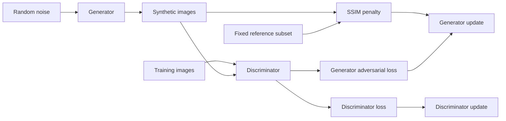

# Engineering decisions

[← Project overview](../README.md)

## Objective and scope

SynEthic explores an image-generation pipeline with a differentiable similarity constraint. The engineering goal is to make experiments configurable, observable, resumable, and easy to exercise without a large dataset. Historical samples demonstrate the original prototype; the current release's tests demonstrate software behavior. [Results and evidence](RESULTS.md) keeps those two claims separate.

The project uses the DCGAN family of architectures described by [Radford, Metz, and Chintala](https://arxiv.org/abs/1511.06434). This implementation adapts the architecture and adds an experimental objective; it is not a reproduction of the paper's reported results.

## Training flow

At the default 64×64 resolution:

| Stage | Shape or operation |
| --- | --- |
| Noise input | 100 values per sample |
| Generator projection | Dense layer → 4×4×256 feature map |
| Upsampling | Four stride-2 transposed convolutions, widths 128 → 64 → 32 → 16 |
| Generator output | 64×64×1, `tanh` activation |
| Discriminator | Four stride-2 convolutions, widths 32 → 64 → 128 → 256 |
| Classification | Flatten → one logit; binary cross-entropy from logits |

The generator uses batch normalization and leaky ReLU before the final output. The discriminator uses leaky ReLU, dropout, and batch normalization after its first block. Both optimizers are Adam with `beta_1=0.5`. The implementation supports partial final batches and checks gradients for non-finite values before applying updates.

## Similarity regularization

For each generated image, `PrivacyGuardian` computes the maximum SSIM against a fixed reference subset. The penalty is the mean amount by which those maxima exceed the configured threshold. Its weighted value is added once to the generator's adversarial loss.

[TensorFlow's SSIM operation](https://www.tensorflow.org/api_docs/python/tf/image/ssim) expects nonnegative pixels. Inputs are mapped from `[-1, 1]` to `[0, 1]`, with `max_val=1`. All operations remain in TensorFlow, including the reference comparisons, so gradients flow through the penalty inside `tf.function`.

| Decision | Benefit | Tradeoff |
| --- | --- | --- |
| Fixed reference subset | Bounded comparison cost and stable references across checkpoint recovery | Cannot detect similarity to every training image |
| First references in filename order | Simple, deterministic selection | May overrepresent related images or patients |
| Thresholded SSIM | Inspectable local image-similarity signal | Not a semantic or clinical measure; zero below the threshold |
| TensorFlow-native computation | Differentiable objective in graph execution | Adds work proportional to batch size × reference count |
| 64×64 default resolution | Small enough for practical experiments | Removes diagnostic detail and limits realism |

The name `PrivacyGuardian` is inherited from the prototype. Its tested property is differentiable similarity regularization; formal privacy or effective memorization prevention has not been established. The default weight and threshold are experimental settings, not validated choices.

## Recovery and model handoff

Training checkpoints include both models, optimizer slots, completed epoch, fixed references, and the training-noise generator. Restoration checks that the full training object graph matches. Configuration checks reject incompatible resume options. Data contents are not hashed, and iterator/dropout state is not completely restored, so exact continuation is outside the current guarantee.

Inference restores only generator variables and epoch, verifies those objects match, and ignores unrelated training state. Sampling uses a separate stateless seed. An optional `.keras` export makes the generator usable without importing this project's trainer. A regression test compares exported-model outputs against the checkpoint-restored generator.

Training checkpoints hold explicit reference images; model exports exclude that state. Neither serialization choice establishes resistance to memorization.

## What changed from the prototypes

The [archived scripts](../experiments/README.md) preserve the earlier experiments. The supported path addresses concrete issues found there:

- Explicit training-folder loading avoids recursively mixing dataset splits.
- TensorFlow-native SSIM replaces NumPy/skimage operations that interrupted the gradient path.
- The similarity penalty is applied once, on correctly scaled pixels.
- Model widths and image dimensions are configurable; smaller fixtures make CPU regression tests practical.
- Full checkpoint checks, overwrite protection, logs, inference, and model export make runs easier to inspect and reuse.

## Next research milestone

A stronger model-quality claim needs a new, fully recorded training run using the supported trainer. The evaluation should compare an unregularized baseline with the similarity objective, use multiple seeds and held-out data, measure diversity and nearest-neighbor similarity, and retain run configurations and outputs. Medical utility and privacy claims would require additional domain-specific evaluation. These experiments have not been completed for this release.
